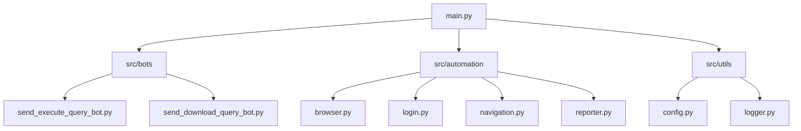

# 🌍 WITS Trade Data Automation Suite


A high-performance, modular automation system designed to streamline trade data extraction from the World Bank's **World Integrated Trade Solution (WITS)**. This suite overcomes complex UI challenges, handles nested frames, and manages asynchronous data processing with professional-grade robustness.

---

## 🏗️ Technical Stack

- **Core Engine**: [Python 3.9+](https://www.python.org/)
- **Automation Framework**: [Playwright](https://playwright.dev/python/) (Chromium)
- **Configuration Engine**: [PyYAML](https://pyyaml.org/)
- **Logging Architecture**: Standard `logging` with specialized rotating query-based handlers.
- **Data Flow**: Custom orchestrator managing modular task-specific bots.

---

## 🌟 Key Features

### 1. Robust Navigation & Popup Resilience
- **Smart Modal Interception**: A global `LocatorHandler` that proactively detects and closes World Bank feedback modals before they intercept UI events.
- **Telerik Overlay Neutralization**: Automatic injection of CSS/JS to eliminate stuck Telerik modal overlays during critical actions.
- **Deep Frame Interaction**: Sophisticated logic to traverse nested iframes (common in WITS ASP.NET environments) to reach confirmation buttons.

### 2. Intelligent Pagination & Result Scanning
- **Ellipsis Handling**: Beyond simple page numbers, the bot understands how to click `...` links to reveal hidden page ranges.
- **State-Aware Navigation**: Verifies page state after every pagination event to ensure data consistency.

### 3. Advanced Error Recovery
- **Stagnation Detection**: Monitors processing progress and automatically restarts iterations if the system detects a stall (e.g., specific country processing is unusually slow).
- **Session Continuity**: Handles session timeouts by re-instantiating the browser context and resuming the state from the last successful checkpoint.

---

## 📂 Project Structure



| Component | Responsibility |
| :--- | :--- |
| `main.py` | Orchestrates the workflow based on `config.yaml` toggles. |
| `src/bots/` | High-level business logic for specific WITS tasks (Querying vs Downloading). |
| `src/automation/` | Atomic browser interactions (Login, Menu Nav, Modal handling). |
| `src/utils/` | System-level services (YAML parsing, custom logging hierarchy). |

---

## � Installation & Setup

### 1. Environment Preparation
```bash
# Clone the repository
git clone <repository-url>
cd UNComtrade

# Create and activate virtual environment
python -m venv venv
source venv/bin/activate

# Install dependencies
pip install -r requirements.txt
playwright install chromium
```

### 2. Configuration (`config.yaml`)
Update the `config.yaml` with your credentials and desired workflow:

```yaml
credentials:
  email: "your_email@domain.com"
  password: "your_password"
  query_name: "2007n" # Target query name for the bots

workflow:
  execute_send_query: true          # Runs the submission bot
  execute_send_download_query: true # Runs the result monitoring bot
```

---

## 🚀 Usage

Run the main orchestrator to start the automation:

```bash
python main.py
```

### � Monitoring Progress
- Check `logs/` for detailed execution traces.
- Query-specific logs (e.g., `logs/2007n.log`) provide granular timing and success/failure status for each reporter.
- `logs/download_2007n.log` tracks the progress of result scanning and download triggers.

---

## 🛠️ Advanced Customization

- **Headless Mode**: Toggle `headless: true/false` in `config.yaml` to run in background or visible mode.
- **Logging Level**: Modify `src/utils/logger.py` to switch between `DEBUG` and `INFO`.
- **Custom Navigation**: Update `src/automation/navigation.py` to add support for new WITS menu items.

---

## 📝 License
This project is licensed under the MIT License - see the `LICENSE` file for details.
